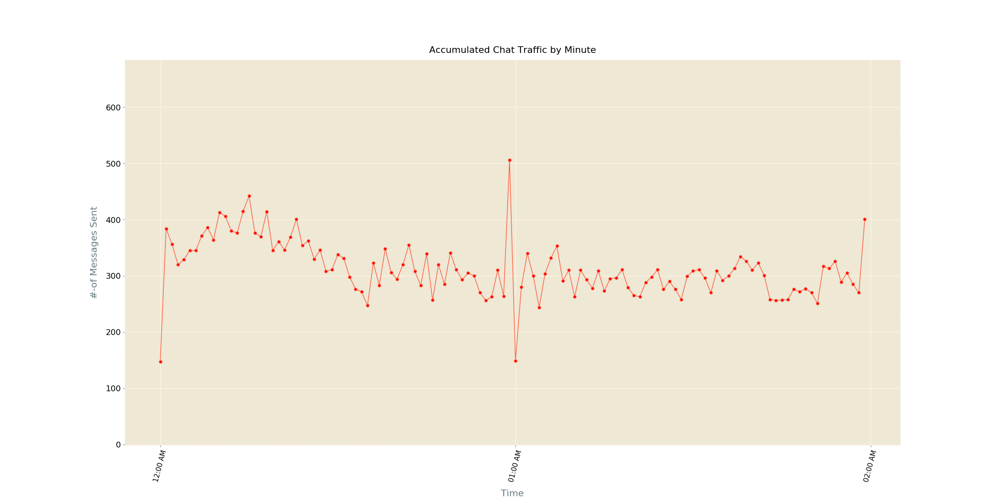

# tgnize



How about another exported Telegram Chat analyzer ? :wink:

## nomenclature
Telegram + _( Chat )_ Analyze = tgnize

## motivation
- I'm always interested in learning more about data, which is why I thought about taking a deeper look into Telegram Chats _( mostly groups )_, I participate in.
- I exported chat data _( excluding audios, videos and images etc. )_, of [Devs Chat](https://t.me/joinchat/BkBvqUQUj4VKPmFSSNPQSw) group, using Telegram Desktop Client, which are nothing but some HTML, CSS & JS files
- I created an object model, into which I populated parsed Chat data, so that I can manipulate it well
- Then I started plotting animated charts & much more _( a lot of work remaining though )_, to depict how participants contributed to chat
- It also lets me understand my chat activity pattern(s) i.e. in which hour of the day I'm mostly active / inactive in Chat
- Or how another peer is spending their time is Chat
- What's mostly used words / mostly used bots / mostly used Emoji etc. in Chat

## data source
Here I'm using [Devs Chat](https://t.me/joinchat/BkBvqUQUj4VKPmFSSNPQSw)'s, exported Chat data set for testing these scripts. So all plots ( to be :wink: ) generated, present in this repository, are result of application of scripts on [Devs Chat](https://t.me/joinchat/BkBvqUQUj4VKPmFSSNPQSw)'s exported Chat data.

Template data set is present [here](./data). It holds all messages of [Devs Chat](https://t.me/joinchat/BkBvqUQUj4VKPmFSSNPQSw) upto _03/11/2019_ from initialization of group.

### exporting chat
For exporting chat data for [Devs Chat](https://t.me/joinchat/BkBvqUQUj4VKPmFSSNPQSw) group of Telegram, I used Official Telegram Desktop Client. Exporting was done, while only including text messages _( no images, videos or audios )_, which are nothing but a bunch of HTML files.

If you want to run these scripts on your machine, make sure you've Telegram Desktop Client installed.

```shell script
$ sudo snap install telegram-desktop # run on your linux terminal
```
Log into your account and choose which chat to export. Well this expoting procedure can take some time, depending upon age & activeness of Chat.

## usage
Detailed installation and usage guide is coming soon. Stay tuned !!!

## progress
- [x] [Depiction of Accumulated Chat Traffic _( for whole Chat along with top **X** chat participants )_](./docs/minuteBasedAccumulatedTraffic.md)
- [ ] Contribution of Chat Participants to Chat
- [ ] Overall Activity of Chat _( for a specified period of time )_
- [ ] Emoji Analysis
- [ ] Text Analysis

_Got some new idea ? Make a PR_ :wink:

**Work in Progress** - _coming with more details soon_
