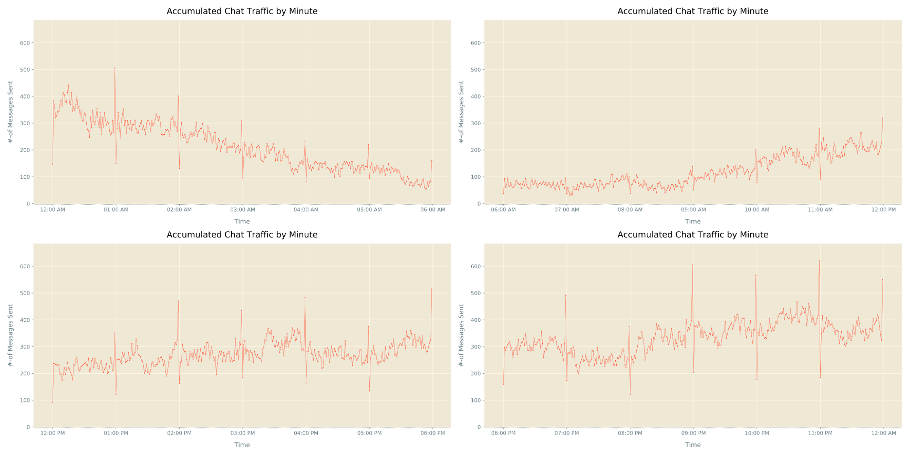
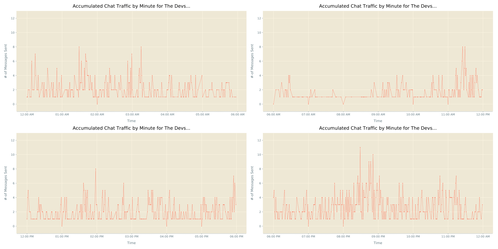
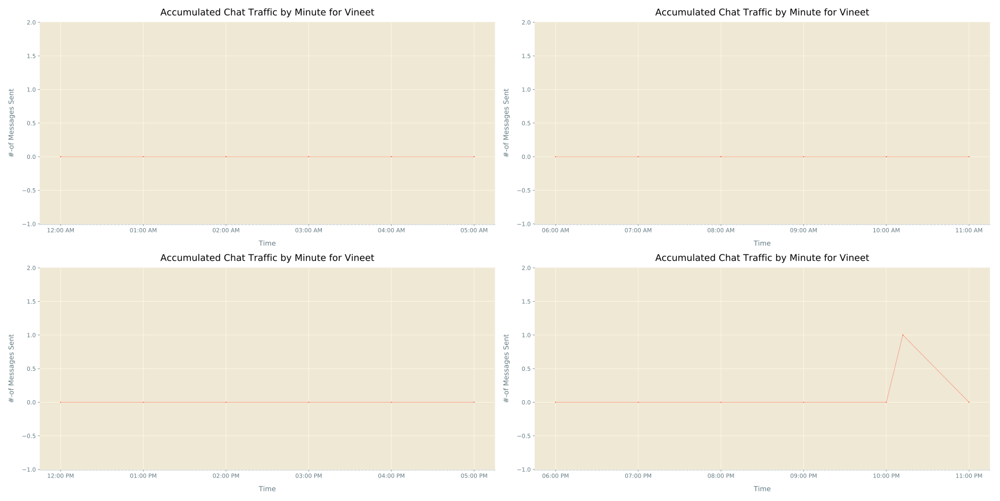
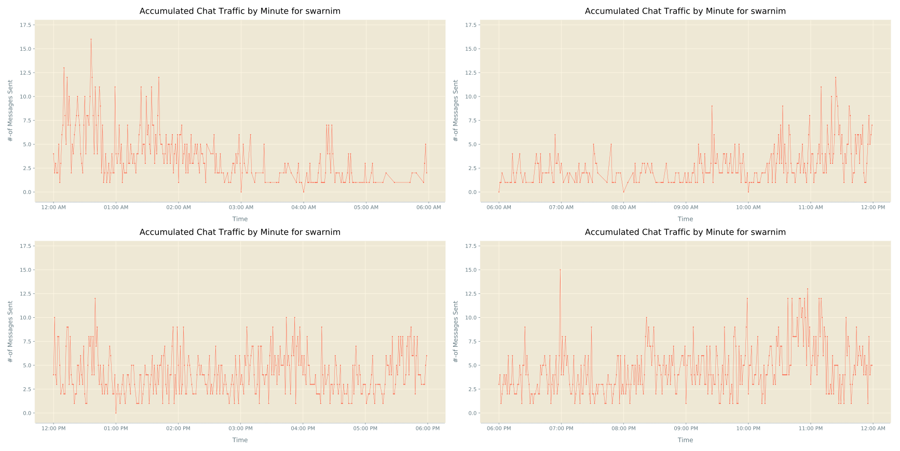
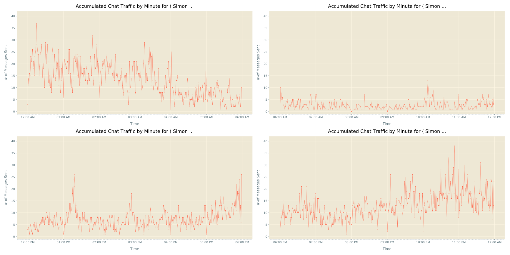

## Accumulated Chat Traffic per Minute
Here we'd like to take a deeper look at how one chat participant has spent his/ her time over this period of time _( for which we're inspecting this Chat )_ in this Chat, at minute level detail.

### How to do so ?
- We've Chat data along with each message tagged with its corresponding time stamp _( time of sending message )_, which will be extracted & one frequency holder is to be created
- Now our job is easy, we can simply plot this dataset, by grouping it into 4 halves _( for sake of simplicity we're splitting a 24 hours lengthy day into 4 equal halves )_
- I've generated a plot, showing activity of Chat _( whole, depicting activity of all participants, over this period of time )_

- Time to do same for all participants of Chat. I've already run this script on our test data _( exported chat of Devs Chat telegram group )_, and the results are pretty interesting.
- I'm putting some of those plots here

_For **The Devs Bot**_

_For **Vineet**_

_For **swarnim**_

_For **⟨ Simon | Schürrle ⟩**_

- Find activity chart for all other participants [here](../plots/)
