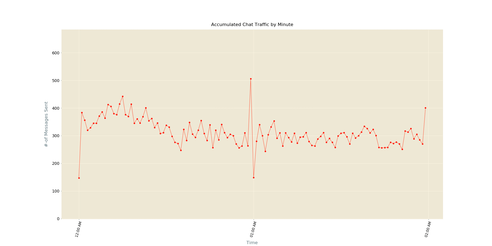
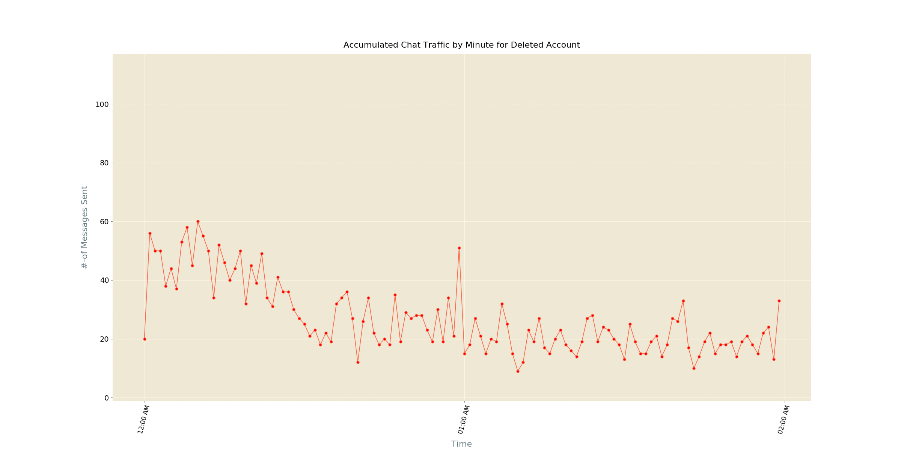
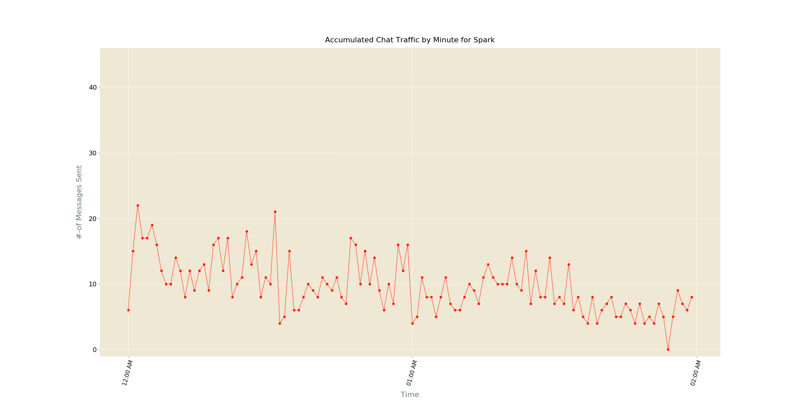
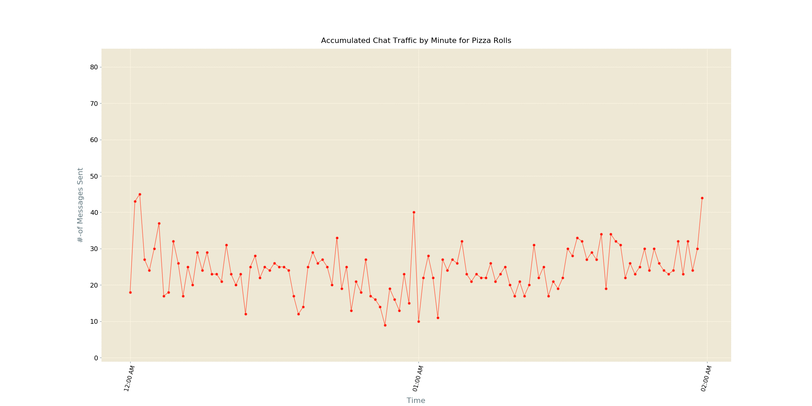
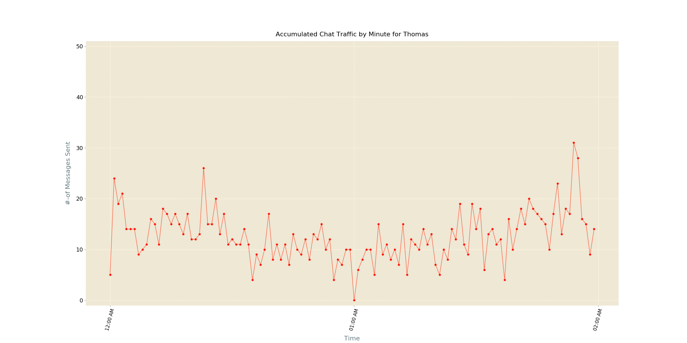

## Accumulated Chat Traffic per Minute
Here we'd like to take a deeper look at how one chat participant has spent his/ her time over this period of time _( for which we're inspecting this Chat )_ in this Chat, at minute level detail.

### How to do so ?
- We've Chat data along with each message tagged with its corresponding time stamp _( time of sending message )_, which will be extracted & one frequency holder is to be built, while accumulating all data
- Now our job is easy, we can simply plot this dataset,
and create one animated plotting, depicting accumulated chat activeness by minute

For whole chat _( Devs Chat telegram group )_

- Time to do same for top **X** participants of Chat. I've already run this script on our test data _( exported chat of Devs Chat telegram group )_, and the results are pretty interesting.

- Here I present, top 5 chat participant's _( of Devs Chat telegram group )_ accumulated chat patterns _( with minute level details )_. **But for privacy reasons I'm hiding their names, so that they can't be traced back.**

Anonymous Participant 1's

Anonymous Participant 2's

Anonymous Participant 3's

Anonymous Participant 4's

Anonymous Participant 5's

