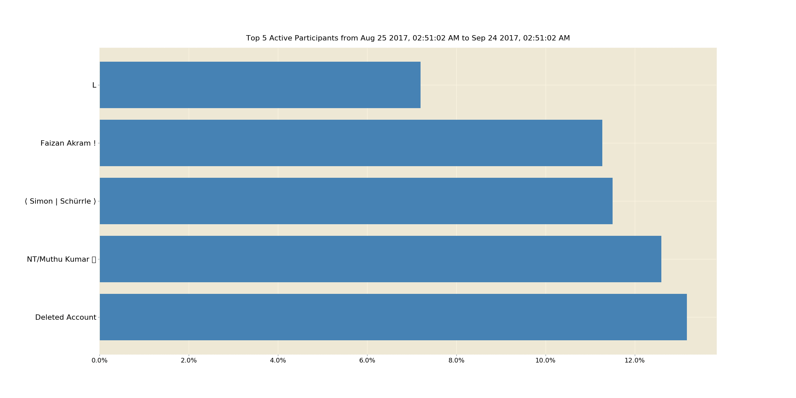

## Top **'X'** Chat Contributor(s) Over Time
Here we try to understand how top **'X'** positions
of Active Chat Participant(s) changed over time i.e. over whole period of time for which we've collected Chat data.

Lets just assume, we want to study status of top **5** active chat participants' position, over a long period of time, while every 30 days' chat contribution will be accumulated into a set, and contributor graph for that 30 days slot to be generated.

As testing data, I'm using prementioned _Devs Chat_'s Chat record, _from day 0 to 03/11/2019_.

So, I splitted almost 2 year lengthy chat record into ~ 26 slots _( each of 30 days length )_, calculating top **5** active chat participant's for each of those time periods and plotting them in horizontal bar chart in animated fashion.

